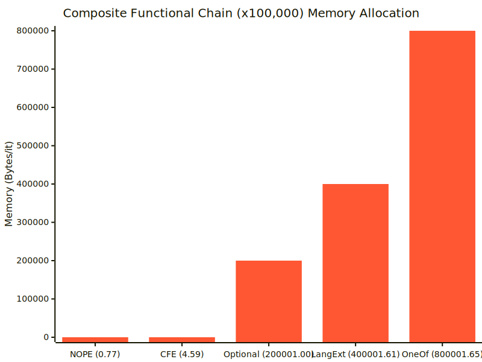

[](https://openupm.com/packages/com.kwanjoong.nope/)
[](LICENSE.md)

<div align="center" style="margin: 20px 0">
  <h3>📚 문서 언어</h3>
  <a href="README.md"></a>
  <a href="README-KR.md"></a>
  <a href="README-JP.md"></a>
  <a href="README-CN.md"></a>
</div>

# NOPE (No Overused Possibly Evil Exceptions)


**CSharpFunctionalExtensions**에서 영감을 받은 유니티용 경량 **제로 할당** 함수형 확장 라이브러리입니다.  
예외 대신 **성공/실패를 명시적으로 표현**하고, null 없이 **선택적 값**을 다루는 `Result<T,E>`와 `Maybe<T>` 타입에 중점을 둡니다.

- **동기**와 **비동기** 워크플로우 모두 **지원**:
    - **UniTask** 통합(`Cysharp.Threading.Tasks`가 설치되고 `NOPE_UNITASK` 심볼이 정의된 경우).
    - **Awaitable** 통합(**Unity6+**에서 내장 `Awaitable`을 사용할 경우, `NOPE_AWAITABLE` 심볼 정의).
- `Result<T,E>`와 `Maybe<T>` 모두에 대한 **완전한 동기 ↔ 비동기 연결**:  
  Map/Bind/Tap/Match/Finally 등이 이제 **"모든 조합"**(동기→비동기, 비동기→동기, 비동기→비동기)을 지원합니다.
- **최소한의 GC 부담**: 메모리 할당을 최소화하기 위해 `readonly struct`로 구현되었습니다.

> **심볼 정의** 사용법:  
> \- **프로젝트 설정**에서 UniTask 기반 비동기를 사용하려면 **`NOPE_UNITASK`**를 정의하세요.  
> \- 내장 Awaitable 통합을 사용하려면 **`NOPE_AWAITABLE`**(Unity6+)을 정의하세요.  
> \- 동기 메서드만 사용할 계획이라면 두 심볼 모두 생략해도 됩니다.  
> \- *두 심볼을 동시에 정의하지 마세요.*

---

## 목차

1. [개발 동기 및 특징](#개발-동기-및-특징)
2. [성능 비교](#성능-비교)
3. [설치 방법](#설치-방법)
4. [예제 프로젝트](#예제-프로젝트)
5. [간단한 "이전 & 이후" 비교](#간단한-이전--이후-비교)
6. [기능 개요](#기능-개요)
7. [Result\<T,E\> 사용법](#resultte-사용법)
    - [Result 생성하기](#1-result-생성하기)
    - [Combine / CombineValues](#2-combine--combinevalues)
    - [SuccessIf, FailureIf, Of](#3-successif-failureif-of)
    - [Bind, Map, MapError, Tap, Ensure, Match, Finally](#4-bind-map-maperror-tap-ensure-match-finally)
8. [Maybe\<T\> 사용법](#maybet-사용법)
    - [Maybe 생성하기](#1-maybe-생성하기)
    - [주요 Maybe 메서드](#2-주요-maybe-메서드)
    - [컬렉션 헬퍼](#3-컬렉션-헬퍼)
    - [LINQ 통합](#4-linq-통합)
9. [비동기 지원](#비동기-지원)
    - [NOPE_UNITASK 또는 NOPE_AWAITABLE](#nope_unitask-또는-nope_awaitable)
    - [동기 ↔ 비동기 연결](#동기--비동기-연결)
10. [사용 예제](#사용-예제)
11. [API 참조](#api-참조)
12. [라이선스](#라이선스)

---

## 개발 동기 및 특징

**NOPE**는 코드에서 **암묵적인 `null` 검사**와 **숨겨진 예외**를 제거하는 것을 목표로 합니다. 이를 위해 다음과 같은 방식을 사용합니다:
- **명시적인 성공/실패**를 표현하는 **Result\<T,E\>**.
- **선택적 값**을 위한 **Maybe\<T\>**, "null 참조 오류 없이 사용할 수 있는 Nullable과 유사".

이를 통해 안전한 변환(`Map`, `Bind`, `Tap`)을 연결하거나, 결과를 처리(`Match`, `Finally`)할 수 있으며 이를 **깔끔한 함수형 스타일**로 할 수 있습니다.

**목표**: 복잡한 코드를 더 **읽기 쉽고**, 안전하며, 오류 처리를 명시적으로 만들기.  
**철학**: 숨겨진 예외나 `null` 관련 문제를 방지. "**실패**" 또는 "**없음**" 상태를 사용자 정의 오류 타입과 함께 명시적으로 반환.

---

## 성능 비교
아래 성능 측정은 NOPE 라이브러리의 기능을 포괄적으로 사용한 환경에서 이루어졌습니다. 이 테스트는 `CSharpFunctionalExtensions`, `Optional`, `LanguageExt`, `OneOf` 라이브러리와의 비교를 포함합니다.

> 모든 라이브러리가 정확히 같은 기능을 제공하는 것은 아닙니다. 일부 경우에는 사용자 관점에서 동등한 결과를 내는 유사한 함수로 비교했습니다.




## 설치 방법

1. **Git (UPM) 사용**:  
   `Packages/manifest.json`에 다음을 추가:
   ```json
   {
     "dependencies": {
       "com.kwanjoong.nope": "https://github.com/kwan3854/Unity-NOPE.git?path=/Packages/Unity-NOPE"
     }
   }
   ```
   특정 버전을 사용하려면:
   ```json
    {
      "dependencies": {
        "com.kwanjoong.nope": "https://github.com/kwan3854/Unity-NOPE.git?path=/Packages/Unity-NOPE#1.3.2"
      }
    }
   ```
2. **Unity Package Manager (Git)**:
    1) `Window → Package Manager` 메뉴 열기
    2) "+" → "Add package from git URL…" 클릭
    3) `https://github.com/kwan3854/Unity-NOPE.git?path=/Packages/Unity-NOPE` 입력. 특정 버전을 사용하려면 `https://github.com/kwan3854/Unity-NOPE.git?path=/Packages/Unity-NOPE#1.3.2`와 같이 버전 태그 추가.

3. **OpenUPM**:  
   명령줄에서 `openupm add com.kwanjoong.nope` 실행.
3. **수동 다운로드**:  
   저장소를 클론하거나 다운로드 후 `Packages/` 또는 `Assets/Plugins` 폴더에 배치.

> [!NOTE] 
> **심볼 정의**:
> - **UniTask** 통합을 사용하려면 `NOPE_UNITASK`
> - Unity6+ 내장 **Awaitable** 통합을 사용하려면 `NOPE_AWAITABLE`
> - 동기 메서드만 사용할 계획이라면 두 심볼 모두 생략 가능
> - *두 심볼을 동시에 정의하지 마세요.*

---

## 예제 프로젝트

이 저장소에는 NOPE 라이브러리를 실제로 활용하는 예제 유니티 프로젝트가 포함되어 있습니다. 예제 프로젝트 사용 방법:

1. 전체 저장소 클론:
   ```bash
   git clone https://github.com/kwan3854/Unity-NOPE.git
   ```
2. 클론한 저장소를 유니티 프로젝트로 열기 (저장소 자체가 유니티 프로젝트임).
3. 유니티 에디터에서 다음 위치에 있는 예제 씬 열기: `Assets/NOPE_Examples/Scene/`
4. 예제 씬을 실행해 다양한 NOPE 라이브러리 기능 확인.
5. `Assets/NOPE_Examples/Scripts/` 폴더의 예제 코드 살펴보기.

## 간단한 "이전 & 이후" 비교

**다음과 같은 상황을 생각해보세요**: 두세 가지 조건을 확인하고, 비동기적으로 데이터를 가져오고, 데이터의 유효성을 검증한 다음, 성공 결과를 반환하거나 오류를 로깅하는 함수가 필요합니다.

### NOPE 없이

```csharp
public async Task<string> DoStuff()
{
    // a) 조건 확인
    if (!CheckA()) 
        throw new Exception("Condition A failed!");

    // b) 데이터 가져오기
    var data = await FetchData(); // null을 반환할 수도 있나요?
    if (data == null)
        return null; // ?

    // c) 파싱 & 검증
    var parsed = Parse(data);
    if (parsed <= 0)
        return "Negative value?";

    // d) 최종 단계 수행
    if (!await FinalStep(parsed))
        return "Final step failed!";
    
    return "All Good!";
}
```
**문제점**: 던져진 예외, `null`, 특수 문자열이 혼합되어 있습니다. 검사를 잊어버리거나 실수로 오류 경로를 건너뛰기 쉽습니다.

### NOPE 사용

```csharp
public async UniTask<Result<string, string>> DoStuff()
{
    return await Result.SuccessIf(CheckA(), Unit.Value, "Condition A failed!")
        .Bind(_ =>  FetchData()
            .Map(data => Parse(data))
            .Ensure(x => x > 0, "Parsed <= 0?"))
        .Bind(parsed => FinalStep(parsed)
            .Map(success => success 
                ? "All Good!" 
                : "Final step failed!"));
}
```

여기서 각 단계는 `Result<T>`를 반환하고, **한 체인**에서 성공/실패를 통합하기 위해 **Bind/Map/Ensure**를 수행합니다. `null`이나 던져진 예외가 없습니다.

---

## 기능 개요

- **Result<T,E>**
    - 체이닝 가능한 메서드: `Map`, `Bind`, `Tap`, `Ensure`, `MapError`, `Match`, `Finally`
    - `Combine`(값 없음) 또는 `CombineValues`(새로운 tuple/array 포함)로 여러 결과 결합

- **Maybe<T>**
    - "옵셔널" 타입, `null` 필요 없음
    - `Map`, `Bind`, `Tap`, `Match`, `Where`, `Execute` 등
    - LINQ 통합 (`Select`, `SelectMany`, `Where`)

- **동기 ↔ 비동기 연결**
    - 모든 메서드(`Bind`, `Map` 등)에 대해 다음이 있습니다:
        - 동기→동기, 동기→비동기, 비동기→동기, 비동기→비동기
    - **UniTask**(`NOPE_UNITASK`인 경우) 또는 **Awaitable**(`NOPE_AWAITABLE`인 경우)와 함께 작동
    - 따라서 단일 체인에서 동기 및 비동기 단계를 원활하게 혼합할 수 있습니다.

- **컬렉션 유틸리티**
    - `Maybe<T>`용: `TryFind`, `TryFirst`, `TryLast`, `Choose` 등

---

## Result\<T,E\> 사용법

### 1) Result 생성하기

```csharp
// 기본 성공/실패
var r1 = Result<int, string>.Success(100);
var r2 = Result<int, string>.Failure("Oops"); 

// 암시적 변환
Result<int, string> r3 = 10;
Assert.IsTrue(r3.IsSuccess);
Assert.AreEqual(10, r3.Value);

Result<int, string> r4 = "Error";
Assert.IsTrue(r4.IsFailure);
Assert.AreEqual("Error", r4.Error);

var a = 100;
var b = 200;
Result<int, string> r5 = b == 0 ?
    "Divide by zero"
    : 100;
Assert.IsTrue(r5.IsSuccess);
Assert.AreEqual(100, r5.Value);

// 사용자 정의 오류 타입 E를 사용하는 경우:
var r6 = Result<int, SomeErrorEnum>.Failure(SomeErrorEnum.FileNotFound);
```

### 2) Combine / CombineValues

1. **`Combine`**
    - 여러 `Result<T,E>`를 단일 **"값 없는"** `Result<Unit, E>`(성공/실패만)로 수집합니다.
    - **모두** 성공이면 → Success()를 반환합니다. **하나라도** 실패하면 → 첫 번째 오류를 반환합니다.

   ```csharp
    var r1 = Result<int, string>.Success(2);
    var r2 = Result<int, string>.Success(3);
    var combined = Result.Combine(r1, r2);
    
    Assert.IsTrue(combined.IsSuccess);
    Assert.AreEqual(Unit.Value, combined.Value);
    
    var r3 = Result<int, string>.Failure("Fail");
    var combined2 = Result.Combine(r1, r3);
    Assert.IsTrue(combined2.IsFailure);
    Assert.AreEqual("Fail", combined2.Error);
   ```

2. **`CombineValues`**
    - 여러 `Result<T,E>`를 단일 `Result<(T1,T2,...) , E>` 또는 `Result<T[], E>`로 수집합니다.
    - 하나라도 실패하면 해당 오류를 반환합니다. 그렇지 않으면 새로운 결합된 "값"을 반환합니다.

   ```csharp
    var r1 = Result<int, string>.Success(2);
    var r2 = Result<int, string>.Success(3);
    var r3 = Result<int, string>.Failure("Fail");
   
    // 두 결과를 튜플로 결합
    var combinedTuple = Result.CombineValues(r1, r2);
    Assert.IsTrue(combinedTuple.IsSuccess);
    Assert.AreEqual((2, 3), combinedTuple.Value);
   
    // 세 결과를 배열로 결합
    var combinedArray = Result.CombineValues(r1, r2, r3);
    Assert.IsTrue(combinedArray.IsFailure);
    Assert.AreEqual("Fail", combinedArray.Error)
   ```

### 3) SuccessIf, FailureIf, Of

- **`SuccessIf(condition, successValue, error)`**  
  → "조건이 참이면 → 성공, 그렇지 않으면 → 실패."
- **`FailureIf(condition, successValue, error)`**  
  → "조건이 참이면 → 실패, 그렇지 않으면 → 성공."
- **`Of(func, errorConverter)`**  
  → try/catch 블록을 래핑하여 예외가 없으면 성공을 반환하고, 그렇지 않으면 fail(error)를 반환합니다.

```csharp
var x = 10;

var r1 = Result.SuccessIf(() => x > 5, x, "TooSmall");
Assert.IsTrue(r1.IsSuccess);

var r2 = Result.FailureIf(() => x % 2 == 0, 999, "CondFailed");
Assert.IsTrue(r2.IsFailure);
Assert.AreEqual("CondFailed", r2.Error);

var r3 = Result.Of(() => x / 0, ex => $"{ex.Message} Added info");
Assert.IsTrue(r3.IsFailure);
Assert.AreEqual("Attempted to divide by zero. Added info", r3.Error);
```

### 4) Bind, Map, MapError, Tap, Ensure, Match, Finally

- **Bind**: 성공 시 `Result<TOriginal,E>` → `Result<TNew,E>`로 변환하고, 그렇지 않으면 오류를 통과시킵니다.
  ```csharp
  var r1 = Result<int, string>.Success(10);
  var r2 = r1.Bind(x => Result<string, string>.Success($"Value is {x}"));
    
  Assert.IsTrue(r2.IsSuccess);
  Assert.AreEqual("Value is 10", r2.Value);
    
  var r3 = Result<int, string>.Failure("Initial failure");
  var r4 = r3.Bind(x => Result<string, string>.Success($"Value is {x}"));
    
  Assert.IsTrue(r4.IsFailure);
  Assert.AreEqual("Initial failure", r4.Error);
  ```
- **Map**: 성공 시 **값**을 변환 → `Result<U,E>`, 추가 오류 없음.
  ```csharp
  var r1 = Result<int, string>.Success(10);
  var r2 = r1.Map(x => x + 1);
  
  Assert.IsTrue(r2.IsSuccess);
  Assert.AreEqual(11, r2.Value);
  
  var r3 = Result<int, string>.Failure("Initial failure");
  var r4 = r3.Map(x => x + 1);
  
  Assert.IsTrue(r4.IsFailure);
  Assert.AreEqual("Initial failure", r4.Error);
  ```
> [!TIP]
> ## Bind vs Map
> ### Map
> 성공 시 간단한 변환 (T → U)
> ```csharp
> // mapFunc:  int => string
> string mapFunc(int x) => $"Value is {x}";
> 
> var r1 = Result<int, string>.Success(10);
> var r2 = r1.Map(mapFunc);
> 
> // r2 : Result<string, string>
> // Success => "Value is 10"
> ```
> `mapFunc` 자체가 문자열을 반환하므로 `Map`은 내부적으로 `Result<string, E>.Success(mapFunc(x))`를 생성합니다. `mapFunc`가 예외나 실패를 생성해야 하는 경우 이는 불가능합니다(직접 throw해야 하는데, 이는 Result 패턴 외부에 있습니다).
> ### Bind
> 성공 시 다른 Result (T → Result<U,E>)
> ```csharp
> // bindFunc:  int => Result<string,string>
> Result<string,string> bindFunc(int x)
> {
>   if (x > 5)
>     return Result<string,string>.Success($"Value is {x}");
>   else
>     return Result<string,string>.Failure("x <= 5");
> }
> 
> var r3 = Result<int,string>.Success(10);
> var r4 = r3.Bind(bindFunc);
> 
> // r4 : Result<string,string>
> // Success => "Value is 10"
> ```
> `bindFunc`는 "성공 또는 실패"를 직접 생성하는 로직을 포함합니다. `Bind`는 "입력이 성공적이면 `bindFunc`를 호출하고 그 결과(성공 또는 실패)를 반환", "입력이 실패면 기존 실패를 유지"하는 방식으로 작동합니다.

- **MapError**: 오류만 변경합니다.
  ```csharp
  var r1 = Result<int, string>.Failure("Initial error");
  var r2 = r1.MapError(e => $"Custom: {e}");
  
  Assert.IsTrue(r2.IsFailure);
  Assert.AreEqual("Custom: Initial error", r2.Error);
  
  var r3 = Result<int, string>.Success(10);
  var r4 = r3.MapError(e => $"Custom: {e}");
  
  Assert.IsTrue(r4.IsSuccess);
  Assert.AreEqual(10, r4.Value);
  ```
- **Tap**: 성공 시 부수 효과를 실행합니다.
  ```csharp
  var r1 = Result<int, string>.Success(10);
  var r2 = r1.Tap(x => Debug.Log($"Value = {x}"));
  
  Assert.IsTrue(r2.IsSuccess);
  Assert.AreEqual(10, r2.Value);
  
  var r3 = Result<int, string>.Failure("Initial failure");
  var r4 = r3.Tap(x => Debug.Log($"Value = {x}"));
  
  Assert.IsTrue(r4.IsFailure);
  Assert.AreEqual("Initial failure", r4.Error);
  ```
- **Ensure**: "성공했지만 조건자를 통과하지 못하면 => fail(error)가 됩니다."
  ```csharp
  var r1 = Result<int, string>.Success(15);
  var r2 = r1.Ensure(x => x > 10, "too small?");
  
  Assert.IsTrue(r2.IsSuccess);
  Assert.AreEqual(15, r2.Value);
  
  var r3 = Result<int, string>.Success(5);
  var r4 = r3.Ensure(x => x > 10, "too small?");
  
  Assert.IsTrue(r4.IsFailure);
  Assert.AreEqual("too small?", r4.Error);
  ```
- **Match**: `Result<T,E>`를 단일 결과로 변환합니다:
  ```csharp
  var r1 = Result<int, string>.Success(10);
  var result1 = r1.Match(
      onSuccess: val => $"Value = {val}",
      onFailure: err => $"Err = {err}"
  );
  
  Assert.AreEqual("Value = 10", result1);
  
  var r2 = Result<int, string>.Failure("Initial failure");
  var result2 = r2.Match(
      onSuccess: val => $"Value = {val}",
      onFailure: err => $"Err = {err}"
  );
  
  Assert.AreEqual("Err = Initial failure", result2);
  ```
- **Finally**: 최종 함수로 "체인 종료".
  ```csharp
  var r1 = Result<int, string>.Success(10);
  var finalString1 = r1.Finally(res =>
  {
      // 부수 효과 수행
      return res.IsSuccess ? "OK" : $"Fail({res.Error})";
  });
  
  Assert.AreEqual("OK", finalString1);
  
  var r2 = Result<int, string>.Failure("Initial failure");
  var finalString2 = r2.Finally(res =>
  {
      // 부수 효과 수행
      return res.IsSuccess ? "OK" : $"Fail({res.Error})";
  });
  
  Assert.AreEqual("Fail(Initial failure)", finalString2);
  ```
- **Or**: 현재 Result가 실패인 경우 대체 Result<T,E>를 제공합니다.
  ```csharp
  var r1 = Result<int, string>.Success(10);
  var r2 = Result<int, string>.Success(20);
  var result1 = r1.Or(r2);
  
  Assert.IsTrue(result1.IsSuccess);
  Assert.AreEqual(10, result1.Value);  // 원래 성공 값
  
  var r3 = Result<int, string>.Failure("첫 번째 오류");
  var r4 = Result<int, string>.Success(30);
  var result2 = r3.Or(r4);
  
  Assert.IsTrue(result2.IsSuccess);
  Assert.AreEqual(30, result2.Value);  // 대체 값
  
  var r5 = Result<int, string>.Failure("첫 번째 오류");
  var r6 = Result<int, string>.Failure("두 번째 오류");
  var result3 = r5.Or(r6);
  
  Assert.IsTrue(result3.IsFailure);
  Assert.AreEqual("두 번째 오류", result3.Error);  // 대체 오류
  ```
- **OrElse**: 현재 Result가 실패인 경우 함수를 통해 대체 Result<T,E>를 제공합니다.
  ```csharp
  var r1 = Result<int, string>.Success(10);
  var result1 = r1.OrElse(() => Result<int, string>.Success(100));
  
  Assert.IsTrue(result1.IsSuccess);
  Assert.AreEqual(10, result1.Value);  // 원래 값
  
  var r2 = Result<int, string>.Failure("오류");
  var result2 = r2.OrElse(() => Result<int, string>.Success(100));
  
  Assert.IsTrue(result2.IsSuccess);
  Assert.AreEqual(100, result2.Value);  // 대체 값
  
  // 대체 함수는 필요할 때만 실행됩니다
  var r3 = Result<int, string>.Success(10);
  var executionCount = 0;
  var result3 = r3.OrElse(() => 
  {
      executionCount++;
      return Result<int, string>.Success(100);
  });
  
  Assert.AreEqual(0, executionCount);  // 실행되지 않음
  Assert.AreEqual(10, result3.Value);
  ```

> 이러한 모든 메서드는 `NOPE_UNITASK`/`NOPE_AWAITABLE`이 설정된 경우 **동기 → 비동기** 또는 **비동기 → 비동기** 변형을 갖습니다.

---

## Maybe\<T\> 사용법

`Maybe<T>`는 옵셔널 값을 나타냅니다(박싱 없이 `Nullable<T>`와 같지만 null 검사가 없습니다).

```csharp
Maybe<int> m1 = 100;         // => HasValue=true
Maybe<int> m2 = Maybe<int>.None; // => 값 없음
```

### 1) Maybe 생성하기

```csharp
// 기본 생성
Maybe<int> m1 = 100;         // => HasValue=true
Maybe<int> m2 = Maybe<int>.None; // => 값 없음

// nullable 타입에서
int? nullableInt = 10;
Maybe<int?> m3 = Maybe<int?>.From(nullableInt); // => HasValue=true
Assert.IsTrue(m3.HasValue);

nullableInt = null;
Maybe<int?> m4 = Maybe<int?>.From(nullableInt); // => 값 없음
Assert.IsFalse(m4.HasValue);
```

### 2) 주요 Maybe 메서드

- **Map**: 값이 존재하면 변환합니다.
  ```csharp
  Maybe<int> m1 = 10;
  Maybe<string> m2 = m1.Map(x => $"Value is {x}");
  
  Assert.IsTrue(m2.HasValue);
  Assert.AreEqual("Value is 10", m2.Value);
  
  Maybe<int> m3 = Maybe<int>.None;
  Maybe<string> m4 = m3.Map(x => $"Value is {x}");
  
  Assert.IsFalse(m4.HasValue);
  ```

- **Bind**: 값을 다른 `Maybe<T>`로 변환합니다.
  ```csharp
  Maybe<int> m1 = 10;
  Maybe<string> m2 = m1.Bind(x => Maybe<string>.From($"Value is {x}"));
  
  Assert.IsTrue(m2.HasValue);
  Assert.AreEqual("Value is 10", m2.Value);
  
  Maybe<int> m3 = Maybe<int>.None;
  Maybe<string> m4 = m3.Bind(x => Maybe<string>.From($"Value is {x}"));
  
  Assert.IsFalse(m4.HasValue);
  ```

- **Tap**: 값이 존재하면 부수 효과를 실행합니다.
  ```csharp
  Maybe<int> m1 = 10;
  m1.Tap(x => Console.WriteLine($"Value = {x}"));
  
  Maybe<int> m2 = Maybe<int>.None;
  m2.Tap(x => Console.WriteLine($"Value = {x}")); // 출력 없음
  ```

- **Match**: `Maybe<T>`를 단일 결과로 변환합니다.
  ```csharp
  Maybe<int> m1 = 10;
  string result1 = m1.Match(
      onValue: val => $"Value = {val}",
      onNone: () => "No value"
  );
  
  Assert.AreEqual("Value = 10", result1);
  
  Maybe<int> m2 = Maybe<int>.None;
  string result2 = m2.Match(
      onValue: val => $"Value = {val}",
      onNone: () => "No value"
  );
  
  Assert.AreEqual("No value", result2);
  ```

- **Where**: `HasValue`가 있지만 조건자를 만족하지 않으면 None이 됩니다.
  ```csharp
  Maybe<int> m1 = 10;
  Maybe<int> m2 = m1.Where(x => x > 5);
  
  Assert.IsTrue(m2.HasValue);
  
  Maybe<int> m3 = 3;
  Maybe<int> m4 = m3.Where(x => x > 5);
  
  Assert.IsFalse(m4.HasValue);
  ```

- **Execute**: Maybe<T>에 값이 있는 경우 액션을 실행합니다.
  ```csharp
    Maybe<int> m1 = 10;
    m1.Execute(val => Console.WriteLine($"This will print: {val}"));
    Assert.AreEqual(10, m1.Value);
    
    Maybe<int> m2 = Maybe<int>.None;
    m2.Execute(val => Console.WriteLine($"This will not print: {val}"));
    Assert.IsFalse(m2.HasValue);
  ```

- **Or**: None인 경우 대체 값을 제공합니다.
  ```csharp
    Maybe<int> m1 = 10;
    Maybe<int> maybeValue1 = m1.Or(0);
  
    Assert.AreEqual(10, maybeValue1.Value);
  
    Maybe<int> m2 = Maybe<int>.None;
    var maybeValue2 = m2.Or(0);
  
    Assert.AreEqual(0, maybeValue2.Value);
  ```

- **GetValueOrThrow**, **GetValueOrDefault**: 직접적인 추출을 위해.
  ```csharp
  Maybe<int> m1 = 10;
  int value1 = m1.GetValueOrThrow();
  
  Assert.AreEqual(10, value1);
  
  Maybe<int> m2 = Maybe<int>.None;
  int value2 = m2.GetValueOrDefault(0);
  
  Assert.AreEqual(0, value2);
  ```

- **OrElse**: None인 경우 함수를 통해 대체 Maybe<T>를 제공합니다.
  ```csharp
  Maybe<int> m1 = 10;
  Maybe<int> result1 = m1.OrElse(() => Maybe<int>.From(100));
  
  Assert.AreEqual(10, result1.Value);  // 원래 값
  
  Maybe<int> m2 = Maybe<int>.None;
  Maybe<int> result2 = m2.OrElse(() => Maybe<int>.From(100));
  
  Assert.AreEqual(100, result2.Value);  // 대체 값
  
  // Maybe가 None일 때 Result<T,E>를 반환할 수도 있습니다
  Maybe<int> m3 = Maybe<int>.None;
  Result<int, string> result3 = m3.OrElse(() => 
      Result<int, string>.Failure("값을 찾을 수 없습니다"));
  
  Assert.IsTrue(result3.IsFailure);
  ```

- **ToResult**: Maybe<T>를 Result<T,E>로 변환합니다. None인 경우 오류로 처리합니다.
  ```csharp
  Maybe<int> m1 = 10;
  Result<int, string> result1 = m1.ToResult("값 없음");
  
  Assert.IsTrue(result1.IsSuccess);
  Assert.AreEqual(10, result1.Value);
  
  Maybe<int> m2 = Maybe<int>.None;
  Result<int, string> result2 = m2.ToResult("값 없음");
  
  Assert.IsTrue(result2.IsFailure);
  Assert.AreEqual("값 없음", result2.Error);
  ```

### 3) 컬렉션 헬퍼

`Maybe<T>`를 반환하는 **컬렉션** 헬퍼를 제공합니다:

- `dict.TryFind(key) -> Maybe<TValue>`
  ```csharp
  Dictionary<string, int> dict = new() { { "apple", 10 }, { "banana", 5 } };
  Maybe<int> found = dict.TryFind("banana");
  
  Assert.IsTrue(found.HasValue);
  Assert.AreEqual(5, found.Value);
  
  Maybe<int> notFound = dict.TryFind("cherry");
  
  Assert.IsFalse(notFound.HasValue);
  ```

- `source.TryFirst()`, `source.TryLast()` → Maybe<T>
  ```csharp
  List<int> list = new() { 1, 2, 3 };
  Maybe<int> first = list.TryFirst();
  
  Assert.IsTrue(first.HasValue);
  Assert.AreEqual(1, first.Value);
  
  Maybe<int> last = list.TryLast();
  
  Assert.IsTrue(last.HasValue);
  Assert.AreEqual(3, last.Value);
  
  List<int> emptyList = new();
  Maybe<int> none = emptyList.TryFirst();
  
  Assert.IsFalse(none.HasValue);
  ```

- `Choose(...)`로 `Maybe<T>` 시퀀스에서 None을 필터링합니다.
  ```csharp
  List<Maybe<int>> list = new() { Maybe<int>.From(1), Maybe<int>.None, Maybe<int>.From(3) };
  List<int> chosen = list.Choose().ToList();
  
  Assert.AreEqual(2, chosen.Count);
  Assert.AreEqual(1, chosen[0]);
  Assert.AreEqual(3, chosen[1]);
  ```

### 4) LINQ 통합

`Select`, `SelectMany`, `Where`가 있어 다음과 같은 작업이 가능합니다:
```csharp
Maybe<int> maybeNum = 50;
var query =
    from x in maybeNum
    where x > 10
    select x * 2;
// => Maybe(100)
```

이제 이 상세한 설명은 `Result<T,E>` 섹션과 동등한 수준이 되었습니다.

---

## 비동기 지원

### NOPE_UNITASK 또는 NOPE_AWAITABLE

**`NOPE_UNITASK`**를 정의하면 Map/Bind/등에 대한 `UniTask<Result<T,E>>` / `UniTask<Maybe<T>>` 오버로드가 추가됩니다.  
**`NOPE_AWAITABLE`**(Unity6+)를 정의하면 `Awaitable<Result<T,E>>` / `Awaitable<Maybe<T>>` 오버로드가 추가됩니다.

### 동기 ↔ 비동기 브리징

```csharp
// syncResult + asyncBinder
public static async UniTask<Result<TNew>> Bind<T,TNew>(
   this Result<T> result,
   Func<T, UniTask<Result<TNew>>> asyncBinder);

public static async Awaitable<Result<TNew>> Bind<T,TNew>(
   this Result<T> result,
   Func<T, Awaitable<Result<TNew>>> asyncBinder);
```

따라서 동기 단계를 비동기 단계로 원활하게 체이닝할 수 있습니다. 마찬가지로 **asyncResult + sync transform** 오버로드도 있습니다.

---

## 사용 예제

1. **여러 체크 & 비동기 호출을 체이닝하기** (`Result<int>` 사용):
   ```csharp
    public async UniTask<string> ComplexOperation()
    {
        return await Result.SuccessIf(CheckA(), 0, "CheckA failed!")
            .Bind(_ => FetchDataAsync()) // => UniTask<Result<string>>
            .Ensure(str => !string.IsNullOrEmpty(str), "Empty data!")
            .Map(str => str.Length)
            .Bind(FinalStepAsync)
            .Match(
                onSuccess: val => $"Final OK: {val}",
                onFailure: err => $"Failure: {err}"
            );
    }
   ```

2. **사전과 함께 Maybe 사용**:
   ```csharp
   Dictionary<string,int> dict = new() {
     {"apple", 10}, {"banana", 5}
   };
   var found = dict.TryFind("banana")
       .Where(x => x >= 5)
       .Map(x => x*2) // => Maybe(10)
       .Execute(value => Debug.Log("HasValue: " + value))
       .ExecuteNoValue(() => Debug.LogWarning("Not found or zero"));
   
   // found => Maybe(10)
   ```

3. **Combine / CombineValues**:
   ```csharp
    var r1 = Result<int, string>.Success(2);
    var r2 = Result<int, string>.Success(3);
    var merged = Result.CombineValues(r1, r2);
    // => Result<(int,int)>.Success((2,3))
   
    var justCheck = Result.Combine(r1, r2);
    // => Result.Success() 또는 첫 번째 오류
   ```

4. **Maybe와 함께 LINQ 사용**:
   ```csharp
   Maybe<int> maybeNum = 10;
   var query =
       from x in maybeNum
       where x > 5
       select x*3;
   // => Maybe(30)
   ```

---

## API 참조

**Result\<T,E\>**
- **Combine** / **CombineValues**
- **SuccessIf**, **FailureIf**, **Of**
- **Bind**, **Map**, **MapError**, **Tap**, **Ensure**, **Match**, **Finally**, **Or**, **OrElse**
- **BindSafe**, **MapSafe**, **TapSafe**
- 동기→비동기 브리징을 위한 오버로드.

**Maybe\<T\>**
- **Map**, **Bind**, **Tap**, **Match**, **Finally**
- **Where**, **Execute**, **Or**, **OrElse**, **ToResult**, **GetValueOrThrow** 등
- 컬렉션에서의 **TryFind**, **TryFirst**, **TryLast**, **Choose**.
- LINQ 연산자: **Select**, **SelectMany**, **Where**.

> 전체 목록은 `NOPE.Runtime.Core.Result` / `NOPE.Runtime.Core.Maybe`의 `.cs` 파일을 참조하세요.

---

## 라이선스

**MIT** 라이선스.  
기여 및 Pull 요청은 환영합니다.

---