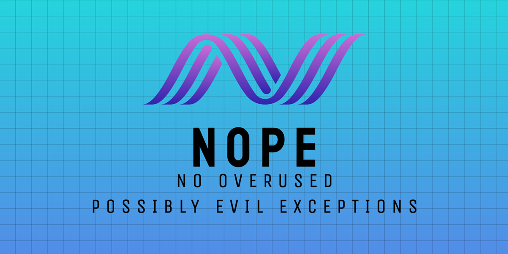
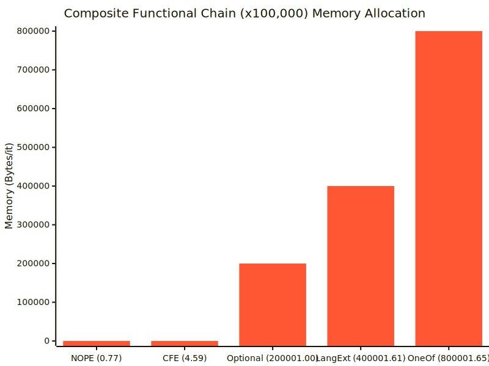
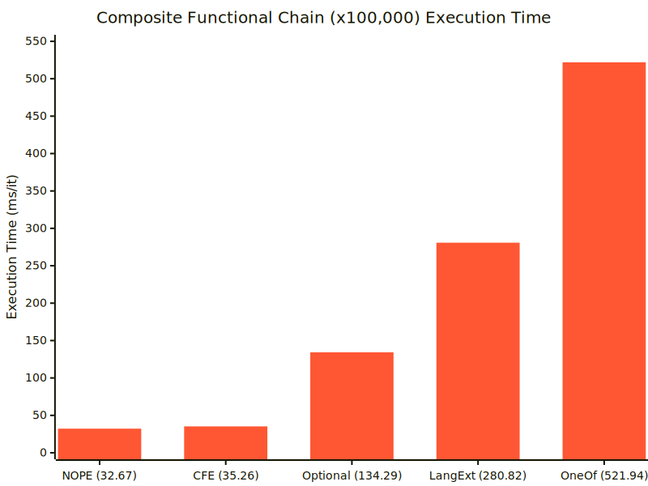

[](https://openupm.com/packages/com.kwanjoong.nope/)
[](LICENSE.md)

# NOPE (No Overused Possibly Evil Exceptions)



A lightweight, **zero-allocation** functional extensions library for Unity, inspired by **CSharpFunctionalExtensions**.  
Focuses on **explicitly handling success/failure** without throwing exceptions and **optional values** without null, using `Result<T,E>` and `Maybe<T>` types.

- **Supports** both **synchronous** and **asynchronous** workflows:
    - **UniTask** integration (if `Cysharp.Threading.Tasks` is installed and `NOPE_UNITASK` define is set).
    - **Awaitable** integration (if on **Unity6+** with built-in `Awaitable`, using `NOPE_AWAITABLE` define).
- **Full sync ↔ async bridging** for both `Result<T,E>` and `Maybe<T>`:  
  Map/Bind/Tap/Match/Finally now have **"all combos"** (sync→async, async→sync, async→async).
- **Minimal GC pressure**: implemented as `readonly struct` to keep allocations low.

> **Define Symbol** Usage:  
> \- In your **Project Settings**, define **`NOPE_UNITASK`** if you want UniTask-based async.  
> \- Or define **`NOPE_AWAITABLE`** (Unity6+) if you want the built-in Awaitable integrations.  
> \- If you only plan to use synchronous methods, you can omit both defines.

---

## Table of Contents

1. [Motivation & Identity](#motivation--identity)
2. [Performance Comparison](#performance-comparison)
3. [Installation](#installation)
4. [Quick “Before & After”](#quick-before--after)
5. [Features Overview](#features-overview)
6. [Result\<T,E\> Usage](#resultte-usage)
    - [Creating a Result](#1-creating-a-result)
    - [Combine / CombineValues](#2-combine--combinevalues)
    - [SuccessIf, FailureIf, Of](#3-successif-failureif-of)
    - [Bind, Map, MapError, Tap, Ensure, Match, Finally](#4-bind-map-maperror-tap-ensure-match-finally)
7. [Maybe\<T\> Usage](#maybet-usage)
    - [Creating a Maybe](#1-creating-a-maybe)
    - [Key Maybe Methods](#2-key-maybe-methods)
    - [Collection Helpers](#3-collection-helpers)
    - [LINQ Integration](#4-linq-integration)
8. [Async Support](#async-support)
    - [NOPE_UNITASK or NOPE_AWAITABLE](#nope_unitask-or-nope_awaitable)
    - [Sync ↔ Async bridging](#sync--async-bridging)
9. [Usage Examples](#usage-examples)
10. [API Reference](#api-reference)
11. [License](#license)

---

## Motivation & Identity

**NOPE** aims to eliminate **silent `null` checks** and **hidden exceptions** from your code. Instead, we use:
- **Result\<T,E\>**  for **explicit success/failure**.
- **Maybe\<T\>**  for optional values, similar to “nullable but without null pointer.”

Thus you can chain safe transformations (`Map`, `Bind`, `Tap`), or handle outcomes (`Match`, `Finally`) in a **clean, functional style**.

**Goal**: Make complex code more **readable**, safer, and explicit about error handling.  
**Philosophy**: No hidden exceptions or `null` surprises. Return “**Failure**” or “**None**” states explicitly, with or without user-defined error types.

---

## Performance Comparison
The following performance measurements were taken in an environment where the NOPE library's features were used comprehensively. The tests include comparisons with `CSharpFunctionalExtensions`, `Optional`, `LanguageExt`, and `OneOf` libraries.

> Please note that not all libraries support exactly the same features. In some cases, similar functions that produce equivalent results from the user's perspective were used for comparison.





## Installation

1. **Via Git (UPM)**:  
   In `Packages/manifest.json`:
   ```json
   {
     "dependencies": {
       "com.kwanjoong.nope": "https://github.com/kwan3854/Unity-NOPE.git?path=/Packages/Unity-NOPE"
     }
   }
   ```
   To specify a version, use:
   ```json
    {
      "dependencies": {
        "com.kwanjoong.nope": "https://github.com/kwan3854/Unity-NOPE.git?path=/Packages/Unity-NOPE#1.2.0"
      }
    }
   ```
2. **Unity Package Manager (Git)**:
    1) `Window → Package Manager`
    2) “+” → “Add package from git URL…”
    3) Paste `https://github.com/kwan3854/Unity-NOPE.git?path=/Packages/Unity-NOPE` to specify a version, append version tag like `https://github.com/kwan3854/Unity-NOPE.git?path=/Packages/Unity-NOPE#1.2.0`.

3. **OpenUPM**:  
   On CLI, `openupm add com.kwanjoong.nope`.
3. **Manual Download**:  
   Clone or download, then place in `Packages/` or `Assets/Plugins`.

> [!NOTE] 
> **Defines**:
> - `NOPE_UNITASK` for using **UniTask** integration
> - `NOPE_AWAITABLE` for Unity6+ built-in **Awaitable** integration
> - Omit both if you only want synchronous usage.
> - *Don't define both at the same time.*

---

## Quick “Before & After”

**Imagine** a function that checks two or three conditions, fetches some data asynchronously, ensures the data is valid, and returns either a success result or logs some error.

### Without NOPE

```csharp
public async Task<string> DoStuff()
{
    // a) check some condition
    if (!CheckA()) 
        throw new Exception("Condition A failed!");

    // b) fetch data
    var data = await FetchData(); // might return null?
    if (data == null)
        return null; // ?

    // c) parse & validate
    var parsed = Parse(data);
    if (parsed <= 0)
        return "Negative value?";

    // d) do final step
    if (!await FinalStep(parsed))
        return "Final step failed!";
    
    return "All Good!";
}
```
**Problems**: We have a mix of thrown exceptions, `null`, special strings. It’s easy to forget checks or accidentally skip error paths.

### With NOPE

```csharp
public async UniTask<Result<string, string>> DoStuff()
{
    return await Result.SuccessIf(CheckA(), Unit.Value, "Condition A failed!")
        .Bind(_ =>  FetchData()
            .Map(data => Parse(data))
            .Ensure(x => x > 0, "Parsed <= 0?"))
        .Bind(parsed => FinalStep(parsed)
            .Map(success => success 
                ? "All Good!" 
                : "Final step failed!"));
}
```

Here, each step returns a `Result<T>`, we do **Bind/Map/Ensure** to unify success/failure in **one chain**. No `null` or thrown exceptions.

---

## Features Overview

- **Result<T,E>**
    - chainable methods: `Map`, `Bind`, `Tap`, `Ensure`, `MapError`, `Match`, `Finally`
    - combine multiple results with `Combine`(no value) or `CombineValues`(with new tuple/array)

- **Maybe<T>**
    - “optional” type, no `null` needed
    - `Map`, `Bind`, `Tap`, `Match`, `Where`, `Execute` and more
    - LINQ integration (`Select`, `SelectMany`, `Where`)

- **Sync ↔ Async bridging**
    - For every method (`Bind`, `Map`, etc.), we have:
        - sync→sync, sync→async, async→sync, async→async
    - Works with **UniTask** (if `NOPE_UNITASK`) or **Awaitable** (if `NOPE_AWAITABLE`)
    - So you can seamlessly mix synchronous and asynchronous steps in a single chain.

- **Collection Utilities**
    - For `Maybe<T>`: `TryFind`, `TryFirst`, `TryLast`, `Choose`, etc.

---

## Result\<T,E\> Usage

### 1) Creating a Result

```csharp
// Basic success/failure
var r1 = Result<int, string>.Success(100);
var r2 = Result<int, string>.Failure("Oops"); 

// Implicit conversion
Result<int, string> r3 = 10;
Assert.IsTrue(r3.IsSuccess);
Assert.AreEqual(10, r3.Value);

Result<int, string> r4 = "Error";
Assert.IsTrue(r4.IsFailure);
Assert.AreEqual("Error", r4.Error);

var a = 100;
var b = 200;
Result<int, string> r5 = b == 0 ?
    "Divide by zero"
    : 100;
Assert.IsTrue(r5.IsSuccess);
Assert.AreEqual(100, r5.Value);

// If you use a custom error type E:
var r6 = Result<int, SomeErrorEnum>.Failure(SomeErrorEnum.FileNotFound);
```

### 2) Combine / CombineValues

1. **`Combine`**
    - Gathers multiple `Result<T,E>` into a single **“valueless”** `Result<Unit, E>` (only success/failure).
    - If **all** are success → returns Success(). If **any** fail → returns the first error.

   ```csharp
    var r1 = Result<int, string>.Success(2);
    var r2 = Result<int, string>.Success(3);
    var combined = Result.Combine(r1, r2);
    
    Assert.IsTrue(combined.IsSuccess);
    Assert.AreEqual(Unit.Value, combined.Value);
    
    var r3 = Result<int, string>.Failure("Fail");
    var combined2 = Result.Combine(r1, r3);
    Assert.IsTrue(combined2.IsFailure);
    Assert.AreEqual("Fail", combined2.Error);
   ```

2. **`CombineValues`**
    - Gathers multiple `Result<T,E>` into a single `Result<(T1,T2,...) , E>` or `Result<T[], E>`.
    - If any fail, returns that error. Otherwise, returns a new combined “value.”

   ```csharp
    var r1 = Result<int, string>.Success(2);
    var r2 = Result<int, string>.Success(3);
    var r3 = Result<int, string>.Failure("Fail");
   
    // Combine two results into a tuple
    var combinedTuple = Result.CombineValues(r1, r2);
    Assert.IsTrue(combinedTuple.IsSuccess);
    Assert.AreEqual((2, 3), combinedTuple.Value);
   
    // Combine three results into an array
    var combinedArray = Result.CombineValues(r1, r2, r3);
    Assert.IsTrue(combinedArray.IsFailure);
    Assert.AreEqual("Fail", combinedArray.Error)
   ```

### 3) SuccessIf, FailureIf, Of

- **`SuccessIf(condition, successValue, error)`**  
  → “if condition is true → success, else → fail.”
- **`FailureIf(condition, successValue, error)`**  
  → “if condition is true → fail, else → success.”
- **`Of(func, errorConverter)`**  
  → Wrap a try/catch block, returning success if no exception, else fail(error).

```csharp
var x = 10;

var r1 = Result.SuccessIf(() => x > 5, x, "TooSmall");
Assert.IsTrue(r1.IsSuccess);

var r2 = Result.FailureIf(() => x % 2 == 0, 999, "CondFailed");
Assert.IsTrue(r2.IsFailure);
Assert.AreEqual("CondFailed", r2.Error);

var r3 = Result.Of(() => x / 0, ex => $"{ex.Message} Added info");
Assert.IsTrue(r3.IsFailure);
Assert.AreEqual("Attempted to divide by zero. Added info", r3.Error);
```

### 4) Bind, Map, MapError, Tap, Ensure, Match, Finally

- **Bind**: transform `Result<TOriginal,E>` → `Result<TNew,E>` if success, else pass through error.
  ```csharp
  var r1 = Result<int, string>.Success(10);
  var r2 = r1.Bind(x => Result<string, string>.Success($"Value is {x}"));
    
  Assert.IsTrue(r2.IsSuccess);
  Assert.AreEqual("Value is 10", r2.Value);
    
  var r3 = Result<int, string>.Failure("Initial failure");
  var r4 = r3.Bind(x => Result<string, string>.Success($"Value is {x}"));
    
  Assert.IsTrue(r4.IsFailure);
  Assert.AreEqual("Initial failure", r4.Error);
  ```
- **Map**: transform the **value** if success → `Result<U,E>`, no extra error.
  ```csharp
  var r1 = Result<int, string>.Success(10);
  var r2 = r1.Map(x => x + 1);
  
  Assert.IsTrue(r2.IsSuccess);
  Assert.AreEqual(11, r2.Value);
  
  var r3 = Result<int, string>.Failure("Initial failure");
  var r4 = r3.Map(x => x + 1);
  
  Assert.IsTrue(r4.IsFailure);
  Assert.AreEqual("Initial failure", r4.Error);
  ```
> [!TIP]
> ## Bind vs Map
> ### Map
> Simple transformation on success (T → U)
> ```csharp
> // mapFunc:  int => string
> string mapFunc(int x) => $"Value is {x}";
> 
> var r1 = Result<int, string>.Success(10);
> var r2 = r1.Map(mapFunc);
> 
> // r2 : Result<string, string>
> // Success => "Value is 10"
> ```
> Since `mapFunc` itself returns a string, `Map` internally creates `Result<string, E>.Success(mapFunc(x))`. If `mapFunc` needs to produce an exception or failure, it is not possible (you would have to throw directly, which is outside the Result pattern).
> ### Bind
> Another Result on success (T → Result<U,E>)
> ```csharp
> // bindFunc:  int => Result<string,string>
> Result<string,string> bindFunc(int x)
> {
>   if (x > 5)
>     return Result<string,string>.Success($"Value is {x}");
>   else
>     return Result<string,string>.Failure("x <= 5");
> }
> 
> var r3 = Result<int,string>.Success(10);
> var r4 = r3.Bind(bindFunc);
> 
> // r4 : Result<string,string>
> // Success => "Value is 10"
> ```
> `bindFunc` contains logic to directly produce "success or failure". `Bind` works by "calling `bindFunc` and returning its result (success or failure) if the input is successful", "keeping the existing failure if the input is a failure".

- **MapError**: only changes the error.
  ```csharp
  var r1 = Result<int, string>.Failure("Initial error");
  var r2 = r1.MapError(e => $"Custom: {e}");
  
  Assert.IsTrue(r2.IsFailure);
  Assert.AreEqual("Custom: Initial error", r2.Error);
  
  var r3 = Result<int, string>.Success(10);
  var r4 = r3.MapError(e => $"Custom: {e}");
  
  Assert.IsTrue(r4.IsSuccess);
  Assert.AreEqual(10, r4.Value);
  ```
- **Tap**: run side effect if success.
  ```csharp
  var r1 = Result<int, string>.Success(10);
  var r2 = r1.Tap(x => Debug.Log($"Value = {x}"));
  
  Assert.IsTrue(r2.IsSuccess);
  Assert.AreEqual(10, r2.Value);
  
  var r3 = Result<int, string>.Failure("Initial failure");
  var r4 = r3.Tap(x => Debug.Log($"Value = {x}"));
  
  Assert.IsTrue(r4.IsFailure);
  Assert.AreEqual("Initial failure", r4.Error);
  ```
- **Ensure**: “if success but fails predicate => become fail(error).”
  ```csharp
  var r1 = Result<int, string>.Success(15);
  var r2 = r1.Ensure(x => x > 10, "too small?");
  
  Assert.IsTrue(r2.IsSuccess);
  Assert.AreEqual(15, r2.Value);
  
  var r3 = Result<int, string>.Success(5);
  var r4 = r3.Ensure(x => x > 10, "too small?");
  
  Assert.IsTrue(r4.IsFailure);
  Assert.AreEqual("too small?", r4.Error);
  ```
- **Match**: convert a `Result<T,E>` into a single outcome:
  ```csharp
  var r1 = Result<int, string>.Success(10);
  var result1 = r1.Match(
      onSuccess: val => $"Value = {val}",
      onFailure: err => $"Err = {err}"
  );
  
  Assert.AreEqual("Value = 10", result1);
  
  var r2 = Result<int, string>.Failure("Initial failure");
  var result2 = r2.Match(
      onSuccess: val => $"Value = {val}",
      onFailure: err => $"Err = {err}"
  );
  
  Assert.AreEqual("Err = Initial failure", result2);
  ```
- **Finally**: “chain termination” with a final function.
  ```csharp
  var r1 = Result<int, string>.Success(10);
  var finalString1 = r1.Finally(res =>
  {
      // do side effects
      return res.IsSuccess ? "OK" : $"Fail({res.Error})";
  });
  
  Assert.AreEqual("OK", finalString1);
  
  var r2 = Result<int, string>.Failure("Initial failure");
  var finalString2 = r2.Finally(res =>
  {
      // do side effects
      return res.IsSuccess ? "OK" : $"Fail({res.Error})";
  });
  
  Assert.AreEqual("Fail(Initial failure)", finalString2);
  ```

> All these methods have **sync → async** or **async → async** variants if `NOPE_UNITASK`/`NOPE_AWAITABLE` is set.

---

## Maybe\<T\> Usage

`Maybe<T>` represents an optional value (like a `Nullable<T>` but without boxing and no null checks).

```csharp
Maybe<int> m1 = 100;         // => HasValue=true
Maybe<int> m2 = Maybe<int>.None; // => no value
```

### 1) Creating a Maybe

```csharp
// Basic creation
Maybe<int> m1 = 100;         // => HasValue=true
Maybe<int> m2 = Maybe<int>.None; // => no value

// From a nullable type
int? nullableInt = 10;
Maybe<int?> m3 = Maybe<int?>.From(nullableInt); // => HasValue=true
Assert.IsTrue(m3.HasValue);

nullableInt = null;
Maybe<int?> m4 = Maybe<int?>.From(nullableInt); // => no value
Assert.IsFalse(m4.HasValue);
```

### 2) Key Maybe Methods

- **Map**: transform the value if it exists.
  ```csharp
  Maybe<int> m1 = 10;
  Maybe<string> m2 = m1.Map(x => $"Value is {x}");
  
  Assert.IsTrue(m2.HasValue);
  Assert.AreEqual("Value is 10", m2.Value);
  
  Maybe<int> m3 = Maybe<int>.None;
  Maybe<string> m4 = m3.Map(x => $"Value is {x}");
  
  Assert.IsFalse(m4.HasValue);
  ```

- **Bind**: transform the value into another `Maybe<T>`.
  ```csharp
  Maybe<int> m1 = 10;
  Maybe<string> m2 = m1.Bind(x => Maybe<string>.From($"Value is {x}"));
  
  Assert.IsTrue(m2.HasValue);
  Assert.AreEqual("Value is 10", m2.Value);
  
  Maybe<int> m3 = Maybe<int>.None;
  Maybe<string> m4 = m3.Bind(x => Maybe<string>.From($"Value is {x}"));
  
  Assert.IsFalse(m4.HasValue);
  ```

- **Tap**: run a side effect if the value exists.
  ```csharp
  Maybe<int> m1 = 10;
  m1.Tap(x => Console.WriteLine($"Value = {x}"));
  
  Maybe<int> m2 = Maybe<int>.None;
  m2.Tap(x => Console.WriteLine($"Value = {x}")); // No output
  ```

- **Match**: convert a `Maybe<T>` into a single outcome.
  ```csharp
  Maybe<int> m1 = 10;
  string result1 = m1.Match(
      onValue: val => $"Value = {val}",
      onNone: () => "No value"
  );
  
  Assert.AreEqual("Value = 10", result1);
  
  Maybe<int> m2 = Maybe<int>.None;
  string result2 = m2.Match(
      onValue: val => $"Value = {val}",
      onNone: () => "No value"
  );
  
  Assert.AreEqual("No value", result2);
  ```

- **Where**: if `HasValue` but doesn’t satisfy the predicate, becomes None.
  ```csharp
  Maybe<int> m1 = 10;
  Maybe<int> m2 = m1.Where(x => x > 5);
  
  Assert.IsTrue(m2.HasValue);
  
  Maybe<int> m3 = 3;
  Maybe<int> m4 = m3.Where(x => x > 5);
  
  Assert.IsFalse(m4.HasValue);
  ```

- **Execute**: run an action if the Maybe<T> has a value.
  ```csharp
    Maybe<int> m1 = 10;
    m1.Execute(val => Console.WriteLine($"This will print: {val}"));
    Assert.AreEqual(10, m1.Value);
    
    Maybe<int> m2 = Maybe<int>.None;
    m2.Execute(val => Console.WriteLine($"This will not print: {val}"));
    Assert.IsFalse(m2.HasValue);
  ```

- **Or**: provide a fallback value if None.
  ```csharp
    Maybe<int> m1 = 10;
    Maybe<int> maybeValue1 = m1.Or(0);
  
    Assert.AreEqual(10, maybeValue1.Value);
  
    Maybe<int> m2 = Maybe<int>.None;
    var maybeValue2 = m2.Or(0);
  
    Assert.AreEqual(0, maybeValue2.Value);
  ```

- **GetValueOrThrow**, **GetValueOrDefault**: for direct extraction.
  ```csharp
  Maybe<int> m1 = 10;
  int value1 = m1.GetValueOrThrow();
  
  Assert.AreEqual(10, value1);
  
  Maybe<int> m2 = Maybe<int>.None;
  int value2 = m2.GetValueOrDefault(0);
  
  Assert.AreEqual(0, value2);
  ```

### 3) Collection Helpers

We provide **collection** helpers returning a `Maybe<T>`:

- `dict.TryFind(key) -> Maybe<TValue>`
  ```csharp
  Dictionary<string, int> dict = new() { { "apple", 10 }, { "banana", 5 } };
  Maybe<int> found = dict.TryFind("banana");
  
  Assert.IsTrue(found.HasValue);
  Assert.AreEqual(5, found.Value);
  
  Maybe<int> notFound = dict.TryFind("cherry");
  
  Assert.IsFalse(notFound.HasValue);
  ```

- `source.TryFirst()`, `source.TryLast()` → Maybe<T>
  ```csharp
  List<int> list = new() { 1, 2, 3 };
  Maybe<int> first = list.TryFirst();
  
  Assert.IsTrue(first.HasValue);
  Assert.AreEqual(1, first.Value);
  
  Maybe<int> last = list.TryLast();
  
  Assert.IsTrue(last.HasValue);
  Assert.AreEqual(3, last.Value);
  
  List<int> emptyList = new();
  Maybe<int> none = emptyList.TryFirst();
  
  Assert.IsFalse(none.HasValue);
  ```

- `Choose(...)` to filter out None from a sequence of `Maybe<T>`.
  ```csharp
  List<Maybe<int>> list = new() { Maybe<int>.From(1), Maybe<int>.None, Maybe<int>.From(3) };
  List<int> chosen = list.Choose().ToList();
  
  Assert.AreEqual(2, chosen.Count);
  Assert.AreEqual(1, chosen[0]);
  Assert.AreEqual(3, chosen[1]);
  ```

### 4) LINQ Integration

We have `Select`, `SelectMany`, `Where` so you can do:
```csharp
Maybe<int> maybeNum = 50;
var query =
    from x in maybeNum
    where x > 10
    select x * 2;
// => Maybe(100)
```

This detailed explanation should now be on par with the `Result<T,E>` section.

---

## Async Support

### NOPE_UNITASK or NOPE_AWAITABLE

If you define **`NOPE_UNITASK`**, we add `UniTask<Result<T,E>>` / `UniTask<Maybe<T>>` overloads for Map/Bind/etc.  
If you define **`NOPE_AWAITABLE`** (Unity6+), we add `Awaitable<Result<T,E>>` / `Awaitable<Maybe<T>>` overloads.

### Sync ↔ Async bridging

```csharp
// syncResult + asyncBinder
public static async UniTask<Result<TNew>> Bind<T,TNew>(
   this Result<T> result,
   Func<T, UniTask<Result<TNew>>> asyncBinder);

public static async Awaitable<Result<TNew>> Bind<T,TNew>(
   this Result<T> result,
   Func<T, Awaitable<Result<TNew>>> asyncBinder);
```

So you can seamlessly chain a synchronous step into an async step. Similarly, we have **asyncResult + sync transform** overloads.

---

## Usage Examples

1. **Chaining multiple checks & async calls** with `Result<int>`:
   ```csharp
    public async UniTask<string> ComplexOperation()
    {
        return await Result.SuccessIf(CheckA(), 0, "CheckA failed!")
            .Bind(_ => FetchDataAsync()) // => UniTask<Result<string>>
            .Ensure(str => !string.IsNullOrEmpty(str), "Empty data!")
            .Map(str => str.Length)
            .Bind(FinalStepAsync)
            .Match(
                onSuccess: val => $"Final OK: {val}",
                onFailure: err => $"Failure: {err}"
            );
    }
   ```

2. **Maybe usage** with dictionary:
   ```csharp
   Dictionary<string,int> dict = new() {
     {"apple", 10}, {"banana", 5}
   };
   var found = dict.TryFind("banana")
       .Where(x => x >= 5)
       .Map(x => x*2) // => Maybe(10)
       .Execute(value => Debug.Log("HasValue: " + value))
       .ExecuteNoValue(() => Debug.LogWarning("Not found or zero"));
   
   // found => Maybe(10)
   ```

3. **Combine / CombineValues**:
   ```csharp
    var r1 = Result<int, string>.Success(2);
    var r2 = Result<int, string>.Success(3);
    var merged = Result.CombineValues(r1, r2);
    // => Result<(int,int)>.Success((2,3))
   
    var justCheck = Result.Combine(r1, r2);
    // => Result.Success() or first error
   ```

4. **LINQ with Maybe**:
   ```csharp
   Maybe<int> maybeNum = 10;
   var query =
       from x in maybeNum
       where x > 5
       select x*3;
   // => Maybe(30)
   ```

---

## API Reference

**Result\<T,E\>**
- **Combine** / **CombineValues**
- **SuccessIf**, **FailureIf**, **Of**
- **Bind**, **Map**, **MapError**, **Tap**, **Ensure**, **Match**, **Finally**
- **BindSafe**, **MapSafe**, **TapSafe**
- Overloads for sync→async bridging.

**Maybe\<T\>**
- **Map**, **Bind**, **Tap**, **Match**, **Finally**
- **Where**, **Execute**, **Or**, **GetValueOrThrow**, etc.
- **TryFind**, **TryFirst**, **TryLast**, **Choose** from collections.
- LINQ operators: **Select**, **SelectMany**, **Where**.

> For the complete list, see the `.cs` files in `NOPE.Runtime.Core.Result` / `NOPE.Runtime.Core.Maybe`.

---

## License

**MIT** License.  
Contributions & Pull requests are welcome.

---